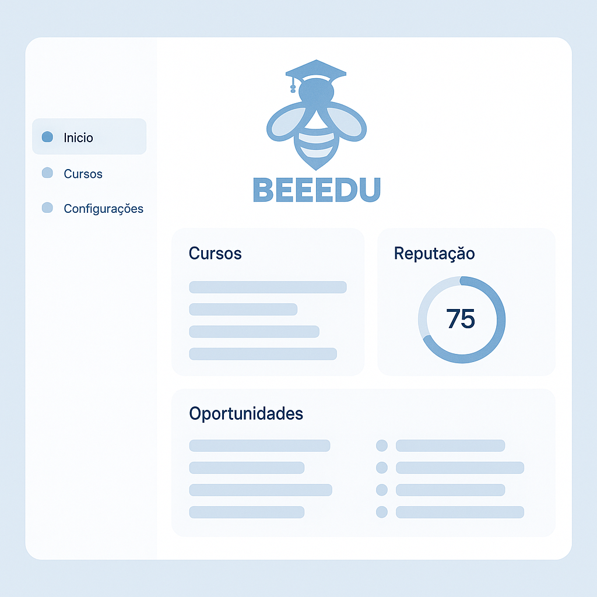

<p align="center">
  
</p>

<h1 align="center">BEEEDU</h1>


<p align="center">
  Plataforma de conexão entre alunos e empresas com Laravel, React, MongoDB, Swagger, Docker, n8n e Inertia.js.
</p>

<p align="center">
  Desenvolvido para o <strong>Edu Hackathon 2025</strong>, uma iniciativa do Instituto Saber Social em parceria com a Edugital, EBAC e Education for Sharing. O evento tem como objetivo reunir profissionais e estudantes para criar soluções inovadoras voltadas à educação pública brasileira.
</p>

<p align="center">
  <a href="#"></a>
  <a href="#"></a>
  <a href="#"></a>
  <a href="#"></a>
  <a href="#"></a>
</p>

<p align="center">
  <em>Conecte estudantes da rede pública ao mercado de trabalho com cursos, oportunidades e gamificação.</em>
</p>

---

## 🎯 Objetivo

O BEEEDU tem como missão aproximar estudantes da rede pública de oportunidades reais no mercado de trabalho. A plataforma oferece uma jornada gamificada com cursos, reputação e conexão com empresas, preparando os alunos para o futuro de forma acessível e engajadora.

Transformando trajetórias estudantis por meio da tecnologia e inovação social. 🚀

---

## 📸 Preview

<p align="center">
  
  <br/>
  <em>Dashboard do aluno com cursos, reputação e oportunidades</em>
</p>

---

## 🚀 Tecnologias

- Laravel + Inertia.js
- React
- MongoDB
- Swagger (API Docs)
- n8n (Integrações)
- Docker (via Laravel Sail)

---

## 💻 Funcionalidades

- [x] Cadastro e login de alunos e empresas
- [x] Feed de oportunidades (freelas)
- [x] Cursos com sistema de progresso
- [x] Reputação e gamificação
- [x] Painel administrativo
- [x] Matching inteligente
- [x] Integrações com n8n

---

## 🛠️ Instalação

```bash
# Clone o projeto
git clone https://github.com/seu-usuario/BEEEDU.git
cd BEEEDU

# Backend
composer install
php artisan key:generate
php artisan migrate

# Frontend
npm install

# Rodar o projeto
./vendor/bin/sail up

```

## 📁 Estrutura do Projeto

```bash
.
├── README.md
├── app
│   ├── Http
│   │   ├── Controllers
│   │   │   ├── Controller.php
│   │   │   └── api/
│   │   └── Middleware/
│   ├── Models/
│   └── Providers/
├── bootstrap/
├── config/
├── database
│   ├── factories/
│   ├── migrations/
│   └── seeders/
├── docker-compose.yml
├── public/
├── resources
│   ├── css/
│   ├── js/
│   │   ├── Components/
│   │   ├── Pages/
│   │   ├── app.jsx
│   │   └── bootstrap.js
│   └── views/
├── routes/
├── tests/
├── vite.config.js
├── package.json
├── composer.json
└── .env.example
```
